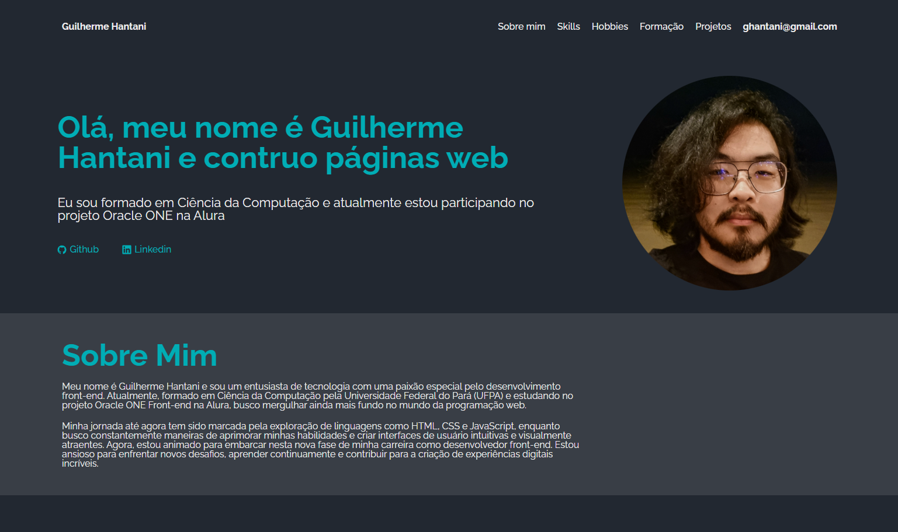

# Desafio Portifolio Alura One ⭐
Este projeto é referente a um desafio de desenvolver um portifólio base proposto no programa de Front-end da Alura ONE (T6), onde o mesmo foi feito com o objetivo de praticar as habilidades de *HTML, CSS* e *Javascript* desenvolvidas ao longo do curso.

## 🔗 Github Pages
O projeto pode ser acessado através do seguinte link: https://guihantani.github.io/portifolio-alura-challenge/